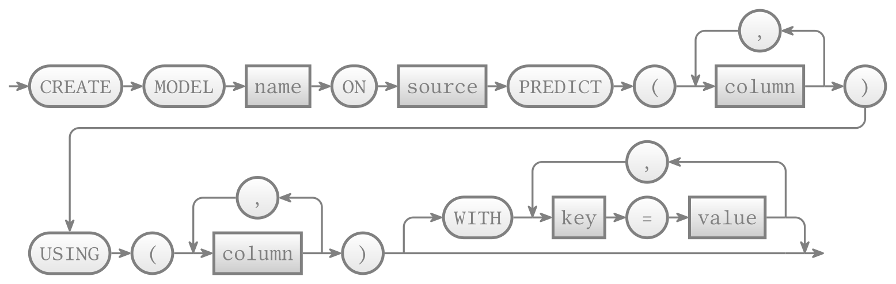
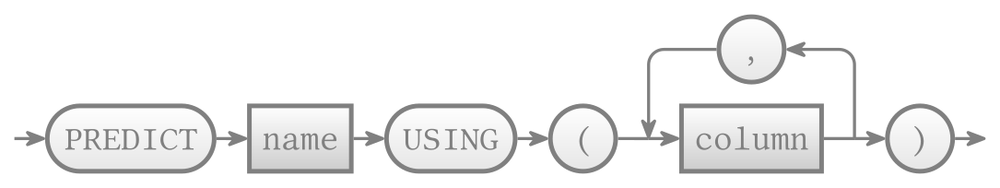
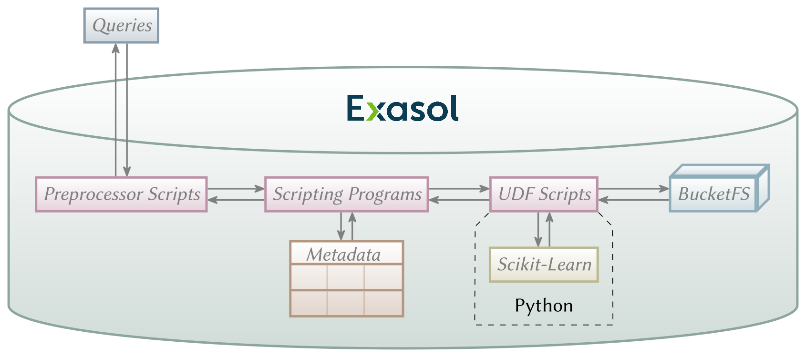

# Exasol-Database Machine-Learning Framework

A framework for extending SQL for machine learning on Exasol database systems.
This framework is not associated with the Exasol company.

> [!WARNING]  
> This page is still under construction.

## Introduction

```sql
CREATE MODEL "model" ON employees PREDICT (salary) USING ("position", birthyear);
```

```sql
SELECT name, "position", birthyear, PREDICT "model" USING ("position", birthyear)
FROM employees WHERE salary IS NULL;
```

## [Syntax for Training a Model](Documentation/SQL_Syntax_ML_Model_Creation.md)

<a rel="syntaxTrain" href="./Documentation/SQL_Syntax_ML_Model_Creation.md"></a>

## [Syntax for Predicting using a Model](Documentation/SQL_Syntax_ML_Model_Prediction.md)

<a rel="syntaxPred" href="./Documentation/SQL_Syntax_ML_Model_Prediction.md"></a>

## [Layers and Elements](Documentation/Layers_Elements_ML_Framework.md)

<a rel="layers" href="./Documentation/Layers_Elements_ML_Framework.md"></a>

## [Currently supported Algorithms](Documentation/ML_Algorithms_supported_by_Framework.md)

| Library      | Namespace    | Algorithm              | Output Type    |
| ------------ | ------------ | ---------------------- | -------------- |
| Scikit-Learn | ensemble     | RandomForestClassifier | Classification |
| Scikit-Learn | linear.model | LinearRegression       | Regression     |
| Scikit-Learn | svm          | SVR                    | Regression     |
| Scikit-Learn | tree         | DecisionTreeClassifier | Classification |
| Scikit-Learn | tree         | DecisionTreeRegressor  | Regression     | 

## Related Publications

- C. Großmann, J. Schildgen: _Integrating Machine Learning into SQL with Exasol_. LWDA 2023
- C. Großmann: _Extending SQL for Machine Learning_, Master thesis, Ostbayerische Tech-
nische Hochschule Regensburg, 2023. https://doi.org/10.35096/othr/pub-6059.
